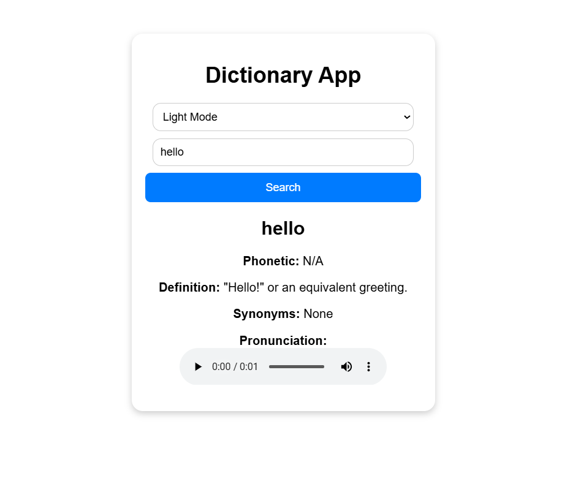

# ✒️ Corsivo — Words, beautifully slanted.

> **Corsivo** is a premium, glassmorphic English Dictionary web application built using vanilla HTML, CSS, and JavaScript. Designed with a dark obsidian look, custom UI widgets, typo auto-corrections, and related follow-up suggestions, it provides a beautiful and immersive learning experience.

---

## 📜 Revival & Historical Context

This repository is very special: **it is one of my first-ever repositories on GitHub!** After sitting as a simple placeholder application for years, it has been completely revived and rebuilt from scratch to mark a new, modern start. 

The transformation from the original layout to the new glassmorphic obsidian interface represents a major upgrade in design principles and front-end development capabilities:

### 📸 Old UI Appearance
Here is the original interface of the application before the modernization:



---

## ✨ Features

- **🎨 Multi-Theme Color System:**
  - **Obsidian Dark (Default):** Premium dark carbon style.
  - **Midnight Cyber:** Dynamic neon blue & magenta cyberpunk aesthetic.
  - **Light Glass:** Crisp, contemporary light theme with high transparency.
  - **Sepia Paper:** Warm bookish sepia tones, ideal for reading comfort.
- **🎛️ Custom UI Components:** Custom-styled select theme dropdown menus and dialog confirmation modals that override native browser dropdowns and dialog prompts.
- **🔍 Typo Matcher & Auto-Correct:** Automatically detects and repairs minor user spelling typos (e.g., "helllo" -> "hello" or "acceptence" -> "acceptance") using sound-alike algorithms and Levenshtein distance checks. Shows a list of "Did you mean?" clickable pills for larger spelling errors.
- **💡 Explore Related Words:** Recommends follow-up words with similar semantic associations to the active searched term to prompt vocabulary exploration.
- **🔊 Smart Audio Pronunciations:** Native phonetic audio recordings with dynamic speaker feedback animations.
- **🗣️ Web Speech TTS Fallback:** Automatic Speech Synthesis voice fallback if no native audio file is supplied by the Free Dictionary API.
- **🔖 Bookmark & Saved Words:** Save definitions locally to study them later. Persists across sessions using browser `localStorage`.
- **🕒 Interactive Search History:** Quickly jump back to recent searches. Easily delete individual elements or clear the history log.
- **🏷️ Interactive Thesaurus:** Tag-based Synonyms and Antonyms. Clicking on any tag automatically runs a search for that word.
- **🎲 Random Word Discovery:** Explore and learn new vocabulary with the "Surprise Me" randomizer button.
- **☀️ Curated Word of the Day:** Kickstart your vocabulary learning with a seed-based daily vocabulary selection.
- **📋 Copy to Clipboard:** Export formatted word details to your notes in a single click.

---

## 🛠️ Technology Stack

- **Core Structure:** HTML5 (Semantic and fully accessible structures).
- **Styling System:** Vanilla CSS3 (Custom properties, grid & flexbox models, glassmorphism, responsive styles).
- **Logic:** Vanilla ES6+ Javascript (Asynchronous Fetch API, Clipboard API, Web Speech Synthesis API, Web LocalStorage).
- **Resources:** Google Fonts (Outfit, Playfair Display) & custom SVG iconography.
- **API Reference:** [Free Dictionary API](https://dictionaryapi.dev/) & [Datamuse API](https://www.datamuse.com/api/).

---

## 🚀 Getting Started

Since Corsivo is a vanilla web application, it does not require complex build steps, packages, or servers.

### Running Locally

1. Clone or download this repository:
   ```bash
   git clone https://github.com/sah-rohit/Simple-Dictionary-App.git
   ```
2. Open `index.html` in any web browser of your choice.
3. Alternatively, host it instantly on a local server using Visual Studio Code's **Live Server** extension, or run standard Python HTTP server in your directory:
   ```bash
   python -m http.server 8000
   ```
   Then visit `http://localhost:8000` in your browser.

---

## 📂 Project Structure

```text
Simple-Dictionary-App/
├── Screenshot/
│   └── image.png  # Old UI screenshot
├── index.html     # Semantic structure, Google fonts, and custom SVG assets
├── styles.css     # Premium design system tokens, themes, layouts, and animations
├── script.js      # Dictionary logic, local storage handles, and Web Audio/Speech features
└── README.md      # Detailed repository documentation
```

---

## 🎨 Preview & Screen Elements

- **Header Panel:** Custom select theme dropdown, Corsivo custom quill branding.
- **Search Component:** Smooth inputs, clear functions, and dice triggers.
- **Result Panel:** Playfair italic typographic headings, custom speaker action controllers, subcard categories for parts of speech, and thesaurus pill tags.
- **Sidebar:** Saved bookmarked list and recent lookup items.

Happy Learning! 📖
